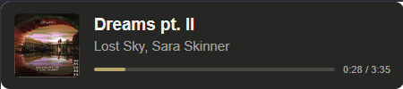

# Playback Overlay

Overlay local de “agora tocando” para OBS, Streamlabs e outros softwares de transmissão que aceitem uma fonte de navegador (*Browser Source*).

Este fork monitora a sessão de mídia ativa do Windows e envia metadados da reprodução por WebSocket para uma página HTML local. Assim, ele pode exibir título, artista, capa, duração e progresso de músicas reproduzidas em aplicativos compatíveis com os controles de mídia do Windows — por exemplo Deezer, Spotify, iTunes, navegadores com YouTube/YouTube Music e outros players que publiquem uma sessão de mídia no Windows.

> Este projeto não usa a API oficial do Deezer, Spotify ou YouTube. A compatibilidade depende de o aplicativo expor corretamente uma sessão de mídia para o Windows.



## Destaques deste fork

- Servidor local WebSocket na porta `9764`.
- Leitura da música atual, artista, álbum, capa, progresso e estado de reprodução.
- Fallback por polling para reduzir travamentos de atualização ao trocar faixas.
- Overlay desaparece suavemente quando a reprodução é pausada ou parada.
- Aplicativo Windows sem terminal visível, executado pelo ícone da bandeja.
- Menu customizado no tray para iniciar/parar o servidor, abrir logs e encerrar o app.
- Ícone próprio para o executável e para a bandeja do Windows.
- Logs em `%LocalAppData%\PlaybackDataServer\server.log`.

## Requisitos

- Windows 10 versão 1511 (November Update) ou superior, ou Windows 11.
- [.NET 8 Desktop Runtime](https://dotnet.microsoft.com/download/dotnet/8.0), caso use uma publicação *framework-dependent*.
- OBS Studio, Streamlabs ou outro software que suporte uma fonte de navegador local.
- Um aplicativo de mídia compatível com os controles de mídia do Windows.

Para validar se um player está expondo dados, comece a reproduzir uma faixa e verifique se ela aparece no painel de mídia/volume do Windows. Se o Windows não reconhecer a sessão de mídia, o overlay também não terá como exibi-la.

## Executar pelo código-fonte

Clone seu fork e entre na pasta do servidor:

```powershell
git clone https://github.com/amarcossousa/playback-overlay.git
cd playback-overlay\server
```

Restaure as dependências e compile:

```powershell
dotnet restore
dotnet build
```

Para iniciar durante desenvolvimento:

```powershell
dotnet run
```

O aplicativo será iniciado sem janela de terminal e exibirá um ícone na área de notificação do Windows. Dependendo da configuração do sistema, ele pode aparecer no menu de ícones ocultos (`^`) ao lado do relógio.

## Usar o aplicativo da bandeja

Clique no ícone do Playback Overlay na bandeja para abrir o menu.

- **Parar servidor**: encerra a captura de mídia e o servidor WebSocket; o ícone permanece disponível.
- **Iniciar servidor**: inicia novamente a captura de mídia e o WebSocket na porta `9764`.
- **Abrir logs**: abre o arquivo de diagnóstico em `%LocalAppData%\PlaybackDataServer\server.log`.
- **Sair**: para o servidor, remove o ícone da bandeja e encerra o aplicativo.

O servidor inicia automaticamente quando o aplicativo é aberto. Para mudar esse comportamento, remova ou comente a chamada `StartServer();` no construtor de `server/App/TrayApp.cs`.

## Publicar para uso diário

Feche o aplicativo pelo item **Sair** antes de publicar uma versão nova. Em seguida, execute:

```powershell
cd server
dotnet publish PlaybackDataServer.csproj -c Release -r win-x64 --self-contained false -o publish
```

O executável será criado em:

```text
server\publish\PlaybackDataServer.exe
```

A opção `--self-contained false` requer o .NET 8 Desktop Runtime instalado na máquina. Para executar em outro computador sem instalar o runtime, publique uma versão independente:

```powershell
dotnet publish PlaybackDataServer.csproj -c Release -r win-x64 --self-contained true -o publish
```

A publicação independente ocupa mais espaço porque inclui o runtime do .NET.

## Iniciar com o Windows

Depois de testar `server\publish\PlaybackDataServer.exe`, crie um atalho para ele e coloque o atalho na pasta de inicialização do usuário:

```powershell
explorer shell:startup
```

O caminho do atalho deve apontar para algo semelhante a:

```text
E:\dev\scrips\playback-overlay\server\publish\PlaybackDataServer.exe
```

Ajuste o caminho conforme o local onde você clonou/publicou o projeto. O executável será aberto após o logon e ficará disponível pela bandeja do Windows, sem deixar uma janela de terminal aberta.

## Configurar no OBS

1. Inicie o Playback Overlay pelo executável publicado ou via `dotnet run`.
2. Abra o player de mídia e inicie uma música.
3. No OBS Studio, adicione uma nova **Fonte de Navegador** (*Browser Source*).
4. Ative **Arquivo local** (*Local File*).
5. Clique em **Procurar** e selecione o arquivo `index.html` do overlay.
6. Use inicialmente estas dimensões:

| Propriedade | Valor recomendado |
|---|---:|
| Largura | 360 px |
| Altura | 80 px |

7. Caso o fundo não fique transparente, defina este CSS personalizado na fonte do OBS:

```css
:root {
  --bg: transparent;
}
```

8. Recarregue a fonte de navegador ou reinicie o OBS após alterar o HTML/CSS/JavaScript do overlay.

O cliente HTML se conecta a:

```text
ws://localhost:9764
```

Mantenha esse endereço caso o OBS e o servidor estejam na mesma máquina. Se mudar a porta no servidor, atualize também `WS_PORT` no `index.html`.

## Comportamento do overlay

- Quando há uma faixa tocando, título, artista, capa, barra de progresso e tempo aparecem no overlay.
- Ao trocar de faixa, o overlay atualiza os metadados e aplica uma transição curta.
- Quando a faixa é pausada ou parada, o overlay fica transparente com uma transição suave.
- Ao retomar a reprodução, ele reaparece automaticamente.
- Se o servidor for parado pelo menu da bandeja, o cliente HTML tentará reconectar a cada 2 segundos até ele voltar.

## Solução de problemas

### O overlay não mostra música

- Confirme que o ícone da bandeja indica **Playback Overlay Server (rodando)**.
- Abra o Deezer/Spotify/navegador e inicie uma faixa antes de abrir ou recarregar a Browser Source.
- Verifique se o player aparece nos controles de mídia do Windows.
- Confirme que o HTML usa `WS_HOST = "localhost"` e `WS_PORT = 9764`.
- Abra os logs em `%LocalAppData%\PlaybackDataServer\server.log` pelo item **Abrir logs**.

### O OBS não atualiza após editar o HTML

- Clique com botão direito na Browser Source e escolha **Atualizar** (*Refresh*).
- Se necessário, feche e abra a fonte ou reinicie o OBS.
- Confirme que selecionou o `index.html` correto, não uma cópia antiga.

### O aplicativo não inicia com o Windows

- Abra `shell:startup` e confira o destino do atalho.
- Dê duplo clique no atalho dentro dessa pasta para validar que ele abre o ícone na bandeja.
- Confirme que o caminho ainda aponta para a pasta `publish` atual.

### A porta 9764 já está em uso

Feche qualquer instância anterior do Playback Overlay pelo item **Sair**. Se necessário, no PowerShell:

```powershell
Get-NetTCPConnection -LocalPort 9764 -ErrorAction SilentlyContinue |
    Select-Object LocalAddress, LocalPort, OwningProcess
```

Identifique o processo e encerre-o apenas se tiver certeza de que é uma instância antiga do aplicativo.

## Desenvolvimento e versionamento

- `master`: versão estável do seu fork.
- `feature/*`: mudanças isoladas, como ajustes de aparência e novas funcionalidades.
- `bin/`, `obj/` e `publish/`: artefatos locais de build; não devem ser versionados.
- Tags seguem versionamento semântico: `vMAJOR.MINOR.PATCH`.

Exemplos:

- `v0.1.0`: primeira versão utilizável.
- `v0.2.0`: nova funcionalidade compatível, como menu customizado na bandeja.
- `v0.2.1`: correção de comportamento, como ocultar o overlay ao pausar.

## Créditos e origem

Este repositório é um fork/modificação do projeto original [Nekonyx/playback-overlay](https://github.com/Nekonyx/playback-overlay).

A captura de mídia depende do NPSMLib e dos mecanismos de sessão de mídia do Windows. A compatibilidade pode variar entre aplicativos, versões do Windows e como cada player integra seus controles de mídia ao sistema.
